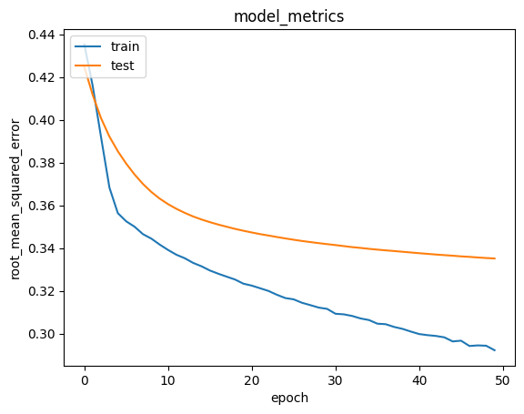

# **Pengembangan Sistem Rekomendasi Buku: Pendekatan Content-Based dan Collaborative Filtering**

Oleh: [Sulhan Fuadi](https://github.com/sulhanfuadi)

---

## **Project Overview**

Dalam era digital, pembaca menghadapi tantangan besar dalam menemukan buku yang relevan di tengah banyaknya pilihan yang tersedia. Sistem rekomendasi buku dirancang untuk memberikan solusi terhadap permasalahan ini dengan menyediakan rekomendasi personal berdasarkan preferensi pembaca. Dengan menggunakan teknik **Content-Based Filtering** dan **Collaborative Filtering**, sistem ini mampu mempermudah pembaca dalam memilih bacaan yang sesuai serta mendukung industri buku melalui peningkatan aksesibilitas dan penjualan.

### **Latar Belakang**

Peningkatan jumlah data di era digital membawa dampak pada semakin sulitnya mencari informasi yang relevan, termasuk dalam pemilihan buku. Menurut penelitian, sistem rekomendasi telah berkembang menjadi alat penting dalam mendukung pengambilan keputusan, seperti yang dijelaskan oleh Khalid Anwar et al. dalam publikasinya _Machine Learning Techniques for Book Recommendation: An Overview_. Sistem rekomendasi membantu pustakawan dalam mengelola katalog perpustakaan dengan efisien, mendukung pembaca dalam menemukan buku terbaik untuk mereka, dan memberikan manfaat bagi penjual buku untuk mengelola inventaris dan meningkatkan keuntungan.

Selain itu, penelitian lain seperti _Book Recommendation System through content based and collaborative filtering method_ oleh Praveena Mathew et al. menunjukkan bahwa sistem rekomendasi berbasis gabungan metode (hybrid) meningkatkan akurasi dengan memanfaatkan kekuatan pendekatan berbasis konten dan pola perilaku pengguna. Penelitian ini mendukung implementasi algoritma hybrid untuk menghasilkan rekomendasi yang lebih efektif dan efisien.

Sebagai tambahan, _Book Recommendation System_ oleh PV Devika et al. menyoroti pentingnya sistem rekomendasi buku dalam membantu pengguna memilih buku yang relevan dan mendorong kebiasaan membaca. Dengan meningkatnya jumlah data yang tersedia, sistem rekomendasi menjadi alat penting untuk membantu pengguna menemukan informasi yang tepat tanpa harus mencari secara manual.

### **Mengapa Proyek Ini Penting**

1. **Meningkatkan Pengalaman Pembaca**: Sistem ini dirancang untuk mempermudah pembaca dalam menemukan buku yang sesuai dengan preferensi mereka, sehingga meningkatkan kegairahan membaca.
2. **Mendukung Industri Buku**: Sistem ini membantu penulis, penerbit, dan penjual buku menjangkau audiens yang lebih luas dan meningkatkan penjualan dengan rekomendasi yang relevan.
3. **Manfaat Sosial**: Membantu mengatasi tantangan literasi global dengan menyediakan rekomendasi buku berbasis data.

Proyek ini menggunakan dataset [Book Recommendation Dataset](https://www.kaggle.com/datasets/arashnic/book-recommendation-dataset) dari Kaggle, yang mencakup data pengguna, buku, dan rating. Dengan memanfaatkan dataset ini, sistem rekomendasi yang dikembangkan diharapkan memberikan manfaat signifikan bagi pembaca dan ekosistem industri buku secara keseluruhan.

---

## **Business Understanding**

### **Proses Klarifikasi Masalah**

Dalam era digital, meningkatnya jumlah data memberikan tantangan dalam membantu pengguna menemukan informasi yang relevan secara efisien. Hal ini menciptakan kebutuhan akan sistem rekomendasi yang mampu mengelola dan memfilter informasi untuk memberikan pengalaman personal bagi pengguna. Sistem rekomendasi buku bertujuan untuk menjawab tantangan ini dengan menyediakan rekomendasi yang sesuai berdasarkan data historis dan preferensi pengguna.

Di industri buku, pengguna menghadapi kesulitan dalam menemukan buku yang sesuai dengan minat mereka karena jumlah pilihan yang tersedia sangat besar. Selain itu, data rating dan interaksi pengguna seringkali tidak dimanfaatkan sepenuhnya untuk mendorong pengalaman membaca yang lebih baik. Oleh karena itu, perlu adanya pendekatan yang memanfaatkan data atribut buku (seperti judul dan penulis) serta data pola perilaku pengguna untuk memberikan rekomendasi yang lebih relevan.

### **Problem Statements**

1. **Bagaimana membangun sistem rekomendasi berbasis konten (Content-Based Filtering)** untuk memberikan rekomendasi buku berdasarkan kesamaan atribut seperti penulis atau judul buku?
2. **Bagaimana memanfaatkan data rating pengguna (Collaborative Filtering)** untuk memberikan rekomendasi buku baru yang mungkin disukai pengguna meskipun mereka belum pernah membaca atau merating buku tersebut sebelumnya?

### **Goals**

1. **Meningkatkan pengalaman membaca pengguna** dengan menghasilkan rekomendasi buku personal yang relevan.
2. **Mempermudah pencarian buku** melalui sistem yang mengoptimalkan data atribut buku dan data rating pengguna.
3. **Mendukung industri buku** dengan membantu penerbit dan penjual buku dalam menjangkau audiens yang lebih luas.

### **Solution Approach**

Untuk mencapai tujuan tersebut, digunakan dua pendekatan utama dalam sistem rekomendasi:

#### **1. Content-Based Filtering**

Pendekatan ini menggunakan atribut buku, seperti judul dan nama penulis, untuk memberikan rekomendasi berdasarkan kesamaan konten.

- **Langkah-Langkah:**

  1. Representasi data menggunakan **TF-IDF Vectorizer** untuk mengonversi atribut buku menjadi vektor fitur.
  2. Menggunakan **Cosine Similarity** untuk mengukur tingkat kesamaan antar buku.
  3. Memberikan rekomendasi top-N buku berdasarkan kemiripan atribut.

- **Kelebihan:**

  - Rekomendasi bersifat personal dan tidak memerlukan data pengguna lain.
  - Cocok untuk kasus dengan data pengguna yang terbatas (cold-start problem).

- **Kekurangan:**
  - Hanya merekomendasikan buku yang serupa dengan buku yang sudah dikenal pengguna.
  - Tidak dapat menangkap preferensi kompleks atau dinamis dari pengguna.

#### **2. Collaborative Filtering**

Pendekatan ini memanfaatkan data interaksi pengguna (rating) untuk memberikan rekomendasi berdasarkan pola perilaku pengguna.

- **Langkah-Langkah:**

  1. Representasi data dalam bentuk matriks pengguna-buku.
  2. Penggunaan algoritma **Neural Collaborative Filtering** untuk mempelajari pola interaksi dan memberikan rekomendasi buku baru.
  3. Evaluasi model menggunakan metrik **Root Mean Squared Error (RMSE)**.

- **Kelebihan:**

  - Mampu merekomendasikan buku baru yang belum pernah dirating pengguna berdasarkan pola pengguna lain.
  - Mengatasi keterbatasan pendekatan berbasis konten dengan memanfaatkan hubungan antar pengguna.

- **Kekurangan:**
  - Membutuhkan data interaksi pengguna dalam jumlah besar untuk hasil yang optimal.
  - Rentan terhadap masalah cold-start untuk pengguna baru atau buku baru tanpa data interaksi.

Pendekatan ini saling melengkapi, di mana Content-Based Filtering efektif untuk pengguna dengan data atribut buku yang lengkap, sementara Collaborative Filtering memberikan hasil optimal untuk memanfaatkan pola interaksi pengguna.

---

## **Data Understanding**

### **Deskripsi Dataset**

Proyek ini menggunakan dataset [Book Recommendation Dataset](https://www.kaggle.com/datasets/arashnic/book-recommendation-dataset) yang diunduh dari platform Kaggle. Dataset ini dikumpulkan oleh Cai-Nicolas Ziegler selama 4 minggu pada tahun 2004 dari komunitas Book-Crossing. Dataset terdiri dari tiga file utama:

1. **Books**: Berisi informasi detail tentang buku, seperti ISBN, judul, penulis, dan penerbit.
2. **Ratings**: Berisi data penilaian buku oleh pengguna, baik eksplisit maupun implisit.
3. **Users**: Berisi data demografi pengguna, seperti lokasi dan usia.

**Ukuran dan Struktur Dataset**:

- **Books**: 271.360 baris dan 8 kolom.
- **Ratings**: 1.149.780 baris dan 3 kolom.
- **Users**: 278.858 baris dan 3 kolom.

Struktur folder dataset:
├── book-dataset <- folder utama
├── books.csv <- informasi buku
├── ratings.csv <- informasi rating buku
└── users.csv <- berisi informasi pengguna

### **Variabel pada Dataset**

#### **Books**

- `ISBN`: Nomor identitas unik buku (International Standard Book Number).
- `Book-Title`: Judul buku.
- `Book-Author`: Nama penulis buku.
- `Year-Of-Publication`: Tahun publikasi buku.
- `Publisher`: Nama penerbit buku.
- `Image-URL-S`: URL gambar kecil buku.
- `Image-URL-M`: URL gambar sedang buku.
- `Image-URL-L`: URL gambar besar buku.

#### **Ratings**

- `User-ID`: Kode unik untuk pengguna anonim.
- `ISBN`: Nomor identitas buku.
- `Book-Rating`: Penilaian pengguna terhadap buku (rentang 0–10).

#### **Users**

- `User-ID`: Kode unik pengguna anonim.
- `Location`: Lokasi pengguna.
- `Age`: Usia pengguna.

### **Tahapan Data Understanding**

#### **1. Data Loading**

Pada bagian ini, dataset akan diakses langsung dari folder dataset yang telah diunduh, yaitu **Book Recommendation Dataset**. Seperti yang telah dijelaskan sebelumnya, terdapat tiga file dataset dalam folder ini, yaitu **Books**, **Ratings**, dan **Users**. Ketiga file ini akan digunakan sebagai sumber data utama dalam proses pengembangan model.

Dataset ini terdiri dari:

- **Books**: Berisi informasi tentang buku, seperti judul, penulis, tahun publikasi, dan penerbit.
- **Ratings**: Berisi data penilaian (rating) yang diberikan oleh pengguna terhadap buku.
- **Users**: Berisi informasi tentang pengguna, termasuk data demografis.

Cuplikan dataset dari **Books**, **Ratings**, dan **Users** masing-masing dapat dilihat secara terperinci berikut.

- **Books**  
  | ISBN | Book-Title | Book-Author | Year-Of-Publication | Publisher |
  |------------|----------------------------------|----------------------|---------------------|------------------------|
  | 0195153448 | Classical Mythology | Mark P. O. Morford | 2002 | Oxford University Press|
  | 0002005018 | Clara Callan | Richard Bruce Wright | 2001 | HarperFlamingo Canada |

- **Ratings**  
  | User-ID | ISBN | Book-Rating |
  |---------|------------|-------------|
  | 276725 | 034545104X | 0 |
  | 276726 | 0155061224 | 5 |

- **Users**  
  | User-ID | Location | Age |
  |---------|-----------------------------------|-----|
  | 1 | nyc, new york, usa | NaN |
  | 2 | stockton, california, usa | 18 |

#### **2. Univariate Exploratory Data Analysis**

Pada tahap ini, dilakukan analisis dan eksplorasi terhadap setiap variabel dalam dataset untuk memahami distribusi dan karakteristik individu dari masing-masing variabel. Pemahaman ini nantinya akan membantu dalam menentukan pendekatan atau algoritma yang cocok diterapkan pada data. Variabel-variabel pada **Book Recommendation Dataset** adalah sebagai berikut:

- **Books**: Merupakan data yang berisi informasi buku, seperti judul, penulis, dan penerbit.
- **Ratings**: Merupakan rating atau peringkat yang diberikan ke buku oleh pengguna atau pembaca.
- **Users**: Merupakan informasi pengguna, termasuk data demografisnya seperti usia dan lokasi.

##### **Books Variabel**

Dataset `Books` berasal dari dataset, yang memiliki 271.360 entri dan terdiri dari 8 kolom:

- `ISBN`: Nomor identifikasi unik buku.
- `Book-Title`: Judul buku.
- `Book-Author`: Nama penulis buku.
- `Year-Of-Publication`: Tahun publikasi buku.
- `Publisher`: Nama penerbit buku.
- `Image-URL-S`, `Image-URL-M`, `Image-URL-L`: URL gambar buku dalam tiga ukuran berbeda.

Setelah menjalankan fungsi `info()`, diketahui bahwa kolom `Year-Of-Publication` bertipe data `object`, sementara seharusnya bertipe data `int`, karena kolom ini berisi tahun publikasi. Setelah mencoba mengonversi tipe data dengan `astype('int')`, muncul error yang menunjukkan adanya teks yang tidak valid dalam kolom tersebut, yaitu 'DK Publishing Inc' dan 'Gallimard'. Oleh karena itu, dua nilai teks ini akan dihapus dari kolom `Year-Of-Publication`. Setelah pembersihan, kolom `Year-Of-Publication` akan dikonversi menjadi tipe data integer.

Selanjutnya, kolom yang tidak diperlukan untuk analisis rekomendasi berbasis konten, seperti `Image-URL-S`, `Image-URL-M`, dan `Image-URL-L`, akan dihapus, karena kolom-kolom ini berisi informasi yang tidak relevan dengan pencocokan berbasis atribut buku.

Setelah proses pembersihan, dataset `Books` akan tersisa dengan 5 kolom:

- `ISBN`
- `Book-Title`
- `Book-Author`
- `Year-Of-Publication`
- `Publisher`

##### **Jumlah yang Diperoleh Setelah Pembersihan**:

- Jumlah `ISBN`: 271.357
- Jumlah `Book-Title`: 242.132
- Jumlah `Book-Author`: 102.022
- Jumlah `Year-Of-Publication`: 116 (jumlah tahun publikasi yang valid)
- Jumlah `Publisher`: 16.805

Distribusi data menunjukkan bahwa jumlah judul buku (242.132) lebih sedikit dibandingkan jumlah ISBN (271.357). Hal ini menunjukkan bahwa ada beberapa entri yang mewakili variasi atau edisi buku yang sama, dengan nomor ISBN yang terdaftar lebih dari satu kali.

Setelah itu, dilakukan analisis distribusi untuk melihat 10 penulis teratas berdasarkan jumlah buku yang mereka tulis. Misalnya, Agatha Christie memiliki lebih dari 600 buku yang terdaftar, yang menunjukkan dominasi penulis tertentu dalam dataset.

##### **Ratings Variabel**

Dataset `Ratings` berisi 1.149.780 entri dan 3 kolom:

- `User-ID`: Kode unik pengguna anonim yang memberikan rating.
- `ISBN`: Nomor ISBN buku yang diberikan rating.
- `Book-Rating`: Rating atau penilaian yang diberikan oleh pengguna pada buku.

Berdasarkan output fungsi `info()`, kita tahu bahwa ada 105.283 pengguna yang memberikan rating terhadap buku. Data rating menunjukkan rentang antara 0 hingga 10, dengan 0 berarti tidak ada rating atau rating yang sangat rendah, dan 10 adalah rating tertinggi.

Namun, banyak rating yang bernilai 0, yang mungkin menunjukkan buku yang tidak dirating atau tidak disukai oleh pengguna. Sebagian besar rating berada di nilai rendah, yang perlu dipertimbangkan ketika mengembangkan model **Collaborative Filtering**.

Karena dataset `Ratings` sangat besar, dengan 1.149.780 entri, untuk efisiensi memori, hanya akan digunakan subset data pertama hingga 5.000 entri untuk pengembangan model **Collaborative Filtering**. Subset ini akan dinamakan `df_rating`.

##### **Users Variabel**

Dataset `Users` berisi informasi tentang pengguna anonim dengan 278.858 entri dan 3 kolom:

- `User-ID`: Kode unik pengguna anonim.
- `Location`: Lokasi geografis pengguna.
- `Age`: Usia pengguna.

Diketahui bahwa ada beberapa nilai kosong (NaN) pada kolom `Age`, yang menunjukkan bahwa usia pengguna tidak dicatat di banyak entri. Data lokasi dan usia pengguna tidak akan digunakan dalam pengembangan model rekomendasi berbasis konten atau collaborative filtering. Oleh karena itu, kedua kolom ini akan diabaikan dalam pemodelan.

Setelah tahap pembersihan dan eksplorasi ini, data siap untuk tahap preprocessing lebih lanjut, di mana dataset akan digabungkan menjadi satu file yang terintegrasi dan siap untuk proses pemodelan.

#### **3. Data Preprocessing**

Seperti yang sudah diketahui berdasarkan tahapan **Data Understanding**, folder **Book Recommendation Dataset** terdiri dari 3 file terpisah, yaitu:

- **books.csv**: Berisi informasi tentang buku seperti judul, penulis, tahun publikasi, dan penerbit.
- **ratings.csv**: Berisi rating yang diberikan pengguna terhadap buku-buku tertentu.
- **users.csv**: Berisi data demografis pengguna seperti usia dan lokasi.

Pada tahap ini, akan dilakukan proses penggabungan file menjadi satu dataset yang terintegrasi agar sesuai dengan pengembangan model yang ingin dibuat. Dataset hasil penggabungan ini akan memiliki 7 variabel yang berasal dari penggabungan variabel-variabel berikut:

- `User-ID` (dari dataset `Ratings`).
- `ISBN` (dari dataset `Ratings` dan `Books`).
- `Book-Rating` (dari dataset `Ratings`).
- `Book-Title` (dari dataset `Books`).
- `Book-Author` (dari dataset `Books`).
- `Year-Of-Publication` (dari dataset `Books`).
- `Publisher` (dari dataset `Books`).

Dengan demikian, dataset gabungan ini akan memiliki 1.149.780 baris data, yang berisi informasi rating buku beserta detail buku yang diberi rating. Dataset ini akan digunakan untuk membangun sistem rekomendasi berbasis **Content-Based Filtering** dan **Collaborative Filtering**.

Setelah penggabungan, tampilan dataset yang sudah terintegrasi akan memiliki struktur sebagai berikut:

| User-ID | ISBN       | Book-Rating | Book-Title                        | Book-Author     | Year-Of-Publication | Publisher                  |
| ------- | ---------- | ----------- | --------------------------------- | --------------- | ------------------- | -------------------------- |
| 276725  | 034545104X | 0           | Flesh Tones: A Novel              | M. J. Rose      | 2002                | Ballantine Books           |
| 276726  | 0155061224 | 5           | Rites of Passage                  | Judith Rae      | 2001                | Heinle                     |
| 276727  | 0446520802 | 0           | The Notebook                      | Nicholas Sparks | 1996                | Warner Books               |
| 276729  | 052165615X | 3           | Help!: Level 1                    | Philip Prowse   | 1999                | Cambridge University Press |
| 276729  | 0521795028 | 6           | The Amsterdam Connection: Level 4 | Sue Leather     | 2001                | Cambridge University Press |

Dengan dataset gabungan ini, informasi buku dan rating pengguna akan terintegrasi dalam satu dataset, yang memungkinkan model rekomendasi untuk memberikan rekomendasi berdasarkan data rating serta atribut buku seperti penulis dan judul.

---

## **Data Preparation**

Karena proyek ini menggunakan dua teknik yang berbeda dalam pengembangan model, yaitu **Content-Based Filtering** dan **Collaborative Filtering**, maka tahap persiapan data akan dibagi menjadi dua bagian. Setiap bagian akan menyiapkan data untuk digunakan dalam pengembangan model yang sesuai.

### **Data Preparation Untuk Model Pengembangan dengan Content Based Filtering**

Pada tahap ini, dilakukan beberapa teknik untuk mempersiapkan data sebelum digunakan pada model **Content-Based Filtering**. Beberapa langkah penting yang dilakukan adalah sebagai berikut:

1. **Menghilangkan Missing Value**

   - Pengecekan pertama kali dilakukan menggunakan kode `books.isnull().sum()` untuk melihat sebaran missing value di dataset.
   - Ditemukan bahwa sebagian besar fitur memiliki nilai yang hilang, dengan kolom `Publisher` memiliki missing value terbesar yaitu 118.650 entri dari total 1.149.780 entri.
   - Meskipun jumlah missing value tersebut tidak terlalu signifikan, namun untuk menjaga kualitas data, maka missing value pada kolom ini dihapus.
   - Dataset yang telah dibersihkan dari missing value disimpan dalam variabel baru bernama `all_books_clean`, dengan jumlah baris yang tersisa sebanyak 1.031.129 baris.

2. **Menyamakan Jenis Buku Berdasarkan ISBN**

   - Karena pada model **Content-Based Filtering**, satu nomor ISBN harus mewakili satu judul buku yang unik, maka langkah berikutnya adalah memastikan tidak ada duplikasi nomor ISBN untuk buku yang berbeda.
   - Melalui pengecekan data, ditemukan bahwa ada beberapa nomor ISBN yang berulang untuk beberapa judul buku yang berbeda, yang bisa menyebabkan bias dalam model.
   - Oleh karena itu, dilakukan penghapusan duplikat berdasarkan kolom `ISBN`, memastikan setiap ISBN hanya memiliki satu judul buku terkait. Setelah proses ini, dataset hanya tersisa sebanyak 270.145 baris data.

3. **Pembuatan Dictionary untuk Proses Pemodelan**
   - Selanjutnya, dibuat dictionary untuk menyimpan data yang telah dibersihkan, dengan key-value untuk `ISBN`, `Book-Title`, `Book-Author`, `Year-Of-Publication`, dan `Publisher`.
   - Hasil dari pembuatan dictionary ini disimpan dalam variabel `books_new`, yang siap digunakan untuk pengembangan model **Content-Based Filtering**.

Tampilan dataset `books_new` setelah menghilangkan missing value dan menyamakan jenis buku berdasarkan ISBN:

| ISBN       | Book-Title                                                     | Book-Author                   | Year-Of-Publication | Publisher                |
| ---------- | -------------------------------------------------------------- | ----------------------------- | ------------------- | ------------------------ |
| 0000913154 | The Way Things Work: An Illustrated Encyclopedia of Technology | C. van Amerongen (translator) | 1967                | Simon & Schuster         |
| 0001010565 | Mog's Christmas                                                | Judith Kerr                   | 1992                | Collins                  |
| 0001046438 | Liar                                                           | Stephen Fry                   | 0                   | Harpercollins Uk         |
| 0001046713 | Twopence to Cross the Mersey                                   | Helen Forrester               | 1992                | HarperCollins Publishers |
| 000104687X | T.S. Eliot Reading "The Wasteland" and Other Poems"            | T.S. Eliot                    | 1993                | HarperCollins Publishers |

Setelah data disiapkan, dataset `books_new` yang berjumlah 270.145 baris akan difilter lebih lanjut untuk memilih data hingga baris ke-20.000. Hal ini dilakukan untuk mengurangi beban memori pada pelatihan model. Dataset yang telah difilter ini akan digunakan dalam pengembangan model **Content-Based Filtering**.

### **Data Preparation Untuk Model Pengembangan dengan Collaborative Filtering**

Pada model pengembangan dengan **Collaborative Filtering**, data akan diproses lebih lanjut untuk memudahkan pelatihan model. Beberapa teknik yang diterapkan pada tahap ini adalah:

1. **Encoding Fitur 'User-ID' dan 'ISBN'**

   - Fitur `User-ID` dan `ISBN` perlu diencode menjadi indeks integer untuk mempermudah proses pelatihan. Proses encoding ini memungkinkan model mengenali setiap pengguna dan buku dengan angka integer yang unik.
   - Penggunaan encoding ini akan membuat representasi data lebih efisien dan dapat diterima oleh algoritma pemodelan.

2. **Pemetaan `User-ID` dan `ISBN` ke DataFrame yang Berkaitan**
   - Setelah encoding, data `User-ID` dan `ISBN` akan dipetakan ke dalam dataframe yang berkaitan. Hal ini akan memudahkan dalam melatih model untuk memahami interaksi antara pengguna dan buku.
3. **Mengecek Jumlah Pengguna dan Buku**

   - Dilakukan pengecekan jumlah pengguna dan buku dalam dataset untuk memastikan data yang digunakan representatif dan sesuai dengan kebutuhan model.
   - Dataset berisi 1.149.780 entri rating, yang akan dibagi menjadi data pelatihan dan data validasi.

4. **Mengubah Rating Menjadi Tipe Data Float**

   - Rating yang diberikan pengguna perlu diubah menjadi tipe data `float` untuk mempermudah perhitungan dan analisis dalam model **Collaborative Filtering**.

5. **Pembagian Data Training dan Validasi**
   - Setelah data dipersiapkan, dataset akan dibagi menjadi dua bagian, yaitu data pelatihan (training) dan data validasi (validation), yang akan digunakan untuk melatih dan menguji model **Collaborative Filtering**.
   - Pembagian data ini penting untuk mengevaluasi kinerja model pada data yang tidak terlihat selama pelatihan.

Setelah seluruh tahapan ini selesai, data siap digunakan untuk proses pelatihan model **Collaborative Filtering** dan **Content-Based Filtering**. Proses data preparation ini penting untuk memastikan bahwa data yang digunakan dalam pengembangan model telah terstruktur dengan baik, bebas dari missing value, dan dapat diproses dengan efisien.

---

## **Modeling and Results**

Pada tahap ini, dua model rekomendasi yang berbeda dikembangkan untuk menyelesaikan masalah rekomendasi buku: **Content-Based Filtering** dan **Collaborative Filtering**. Setiap model memiliki kekuatan dan kelemahan masing-masing, dan keduanya berkontribusi untuk memberikan solusi rekomendasi yang lebih tepat dan relevan bagi pengguna. Di bawah ini, kami akan menjelaskan kedua pendekatan ini secara mendalam, serta hasil yang diperoleh untuk masing-masing model.

### **Model Development dengan Content-Based Filtering**

**Content-Based Filtering** adalah metode dalam sistem rekomendasi yang menggunakan informasi atau konten dari item untuk memberikan rekomendasi. Dalam kasus ini, informasi konten yang digunakan adalah atribut buku seperti judul, penulis, dan tahun publikasi. Tujuan utama dari pendekatan ini adalah untuk merekomendasikan buku yang memiliki kesamaan atribut dengan buku yang telah disukai atau dibaca oleh pengguna.

#### **Proses Pengembangan Model**

1. **Representasi Fitur Menggunakan TF-IDF**

   - Teknik **TF-IDF (Term Frequency - Inverse Document Frequency)** digunakan untuk menghitung representasi fitur dari setiap buku berdasarkan penulis dan judul buku.
   - TF-IDF vectorizer mengubah teks (seperti nama penulis atau judul buku) menjadi vektor numerik yang merepresentasikan pentingnya kata-kata dalam teks. Semakin sering sebuah kata muncul dalam dokumen, semakin tinggi nilai TF-nya, sementara IDF mengukur seberapa jarang kata tersebut muncul di seluruh koleksi dokumen.

2. **Proses Vektorisasi**

   - Proses vektorisasi dilakukan dengan `TfidfVectorizer` dari library `sklearn`. Fungsi ini mengubah kolom `Book-Author` dan `Book-Title` menjadi representasi vektor numerik.
   - Matriks TF-IDF yang dihasilkan memiliki ukuran `(20000, 8746)`, di mana 20000 adalah jumlah buku dan 8746 adalah fitur unik yang mewakili kata-kata dalam koleksi data buku.
   - Selanjutnya, menggunakan fungsi `todense()` untuk mengonversi matriks yang dihasilkan menjadi bentuk yang lebih mudah dibaca.

3. **Cosine Similarity**

   - Untuk mengukur kesamaan antar buku, digunakan **Cosine Similarity**, yang mengukur sudut kosinus antara dua vektor fitur.
   - Semakin kecil sudut antara dua vektor, semakin besar kesamaannya. Fungsi `cosine_similarity` digunakan untuk menghitung matriks kesamaan antar buku berdasarkan vektor TF-IDF yang telah dihasilkan.

4. **Top-N Recommendations**
   - Dengan menggunakan matriks kesamaan (similarity matrix), sistem dapat memilih top-N buku yang paling mirip dengan buku yang telah dibaca atau disukai oleh pengguna.
   - Fungsi `book_recommendations()` digunakan untuk menghasilkan daftar rekomendasi berdasarkan tingkat kemiripan. Parameter `k` digunakan untuk mengatur jumlah rekomendasi (top-N), dengan nilai default 5.

#### **Hasil Content-Based Filtering**

Contoh rekomendasi yang diberikan oleh sistem berdasarkan buku yang dicontohkan adalah sebagai berikut:

Contoh judul buku yang digunakan untuk menampilkan rekomendasi:

| ISBN       | Book Title                                                                               | Book Author   | Year of Publication | Publisher          |
| ---------- | ---------------------------------------------------------------------------------------- | ------------- | ------------------- | ------------------ |
| 0060654775 | Entering the Silence: Becoming a Monk and a Writer (The Journals of Thomas Merton, V. 2) | Thomas Merton | 1997                | HarperSanFrancisco |

Berdasarkan buku ini, model memberikan 5 rekomendasi teratas berdasarkan kesamaan atribut (seperti penulis):

Hasil rekomendasi 5 judul buku teratas:

| Book Title                                                                                                                          | Book Author   |
| ----------------------------------------------------------------------------------------------------------------------------------- | ------------- |
| Dancing in the Water of Life: Seeking Peace in the Hermitage (Merton, Thomas//Journal of Thomas Merton)                             | Thomas Merton |
| Dialogues with Silence: Prayers and Drawings                                                                                        | Thomas Merton |
| The Other Side of the Mountain: The End of the Journey (Merton, Thomas//Journal of Thomas Merton)                                   | Thomas Merton |
| Run to the Mountain: The Story of a VocationThe Journal of Thomas Merton, Volume 1: 1939-1941 (The Journals of Thomas Merton, V. 1) | Thomas Merton |
| Turning Toward the World: The Pivotal Years (The Journals of Thomas Merton, Volume 4: 1960-1963)                                    | Thomas Merton |

**Kelebihan Content-Based Filtering**:

- Memberikan rekomendasi yang sangat personal, karena berdasarkan pada preferensi atau riwayat buku yang telah dilihat atau dibaca oleh pengguna.
- Dapat mengatasi masalah **cold-start** (ketika tidak ada data rating sebelumnya) dan memberikan rekomendasi yang berguna sejak awal.
- Tidak bergantung pada data pengguna lain, sehingga risiko bias atau manipulasi lebih rendah.

**Kekurangan Content-Based Filtering**:

- Risiko **filter bubble**, di mana sistem hanya merekomendasikan buku yang mirip dengan yang sudah diketahui oleh pengguna, membatasi variasi rekomendasi.
- Sulit untuk menangkap preferensi yang lebih kompleks atau dinamis dari pengguna, terutama ketika item yang mirip tidak mencerminkan keseluruhan preferensi pengguna.

### **Model Development dengan Collaborative Filtering**

**Collaborative Filtering** adalah metode rekomendasi yang mengandalkan data rating pengguna untuk memprediksi preferensi pengguna terhadap item tertentu. Teknik ini berfokus pada pola interaksi antar pengguna, dengan asumsi bahwa pengguna dengan preferensi yang serupa di masa lalu akan terus memiliki preferensi yang mirip di masa depan.

#### **Proses Pengembangan Model**

1. **Encoding Fitur User-ID dan ISBN**

   - Fitur `User-ID` dan `ISBN` dienkode menjadi indeks integer untuk mempermudah pemrosesan dan perhitungan kesamaan antar pengguna dan item.

2. **Pembagian Data untuk Training dan Validasi**

   - Data dibagi menjadi dua bagian, yaitu **data pelatihan** (90%) dan **data validasi** (10%). Pembagian ini penting untuk menguji model pada data yang tidak terlihat selama pelatihan, sehingga evaluasi dapat lebih akurat.

3. **Model Training menggunakan Embedding**

   - **Embedding** digunakan untuk mewakili pengguna dan buku dalam ruang vektor yang lebih rendah, memungkinkan model untuk mempelajari hubungan antara pengguna dan item.
   - Dot product antara embedding pengguna dan buku dihitung untuk memperoleh skor kecocokan, dengan menambahkan bias untuk masing-masing pengguna dan buku.
   - Model dilatih menggunakan **Binary Crossentropy** sebagai fungsi kerugian dan **Adam** sebagai optimizer.

4. **Model Evaluation dengan RMSE**
   - **Root Mean Squared Error (RMSE)** digunakan untuk mengevaluasi seberapa baik model dapat memprediksi rating pengguna berdasarkan data yang ada. RMSE yang lebih rendah menunjukkan model yang lebih baik.
   - Hasil pelatihan menunjukkan RMSE sekitar 0.2939 pada data pelatihan dan 0.3353 pada data validasi, yang menunjukkan performa yang memuaskan.

#### **Hasil Collaborative Filtering**

Setelah model dilatih, sistem dapat memberikan rekomendasi berdasarkan rating pengguna yang belum diberikan pada buku tertentu. Berikut adalah 10 buku teratas yang direkomendasikan untuk pengguna tertentu:

Hasil top-N recommendation berupa buku dengan rating tertinggi dari user:

| Book Title              | Book Author     |
| ----------------------- | --------------- |
| My "Star Trek" Memories | William Shatner |

Hasil top-N recommendation berupa 10 buku teratas yang direkomendasikan:

| Book Title                                                                                    | Book Author         |
| --------------------------------------------------------------------------------------------- | ------------------- |
| Silence of the Sirens                                                                         | Adel Garcia Morales |
| Politically Correct Bedtime Stories: Modern Tales for Our Life and Times                      | James Finn Garner   |
| On Writing Well, 25th Anniversary : The Classic Guide to Writing Nonfiction (On Writing Well) | William Zinsser     |
| Get Shorty                                                                                    | Elmore Leonard      |
| One for the Money (Stephanie Plum Novels (Paperback))                                         | Janet Evanovich     |
| Junky                                                                                         | William Burroughs   |
| The Oranging of America and Other Stories                                                     | Max Apple           |
| Joke                                                                                          | Milan Kundera       |
| Tales of Mystery and Terror (Puffin Classics)                                                 | Edgar Allan Poe     |
| War and Peace (Penguin Classics)                                                              | Leo Tolstoy         |

**Kelebihan Collaborative Filtering**:

- Mampu memberikan rekomendasi yang sangat personal berdasarkan pola preferensi dan perilaku pengguna lain.
- Tidak memerlukan informasi mendalam tentang item yang direkomendasikan, cukup pola interaksi antar pengguna.

**Kekurangan Collaborative Filtering**:

- **Cold-start problem**: Sistem kesulitan memberikan rekomendasi yang akurat untuk pengguna baru atau item baru yang belum memiliki cukup data.
- **Sparsity**: Jika data sangat jarang, yaitu sebagian besar pengguna hanya memberikan rating untuk sedikit item, model akan kesulitan memberikan rekomendasi yang baik.
- **Kompleksitas**: Perhitungan kesamaan antar pengguna atau item semakin sulit seiring bertambahnya jumlah pengguna atau item.

---

## **Evaluation**

Pada tahap evaluasi ini, dua model yang dikembangkan—**Content-Based Filtering** dan **Collaborative Filtering**—dievaluasi dengan menggunakan metrik yang sesuai untuk masing-masing teknik. Metrik yang digunakan untuk mengukur kinerja model pada proyek ini adalah **Precision**, **Recall**, **F1-Score** untuk model **Content-Based Filtering**, dan **Root Mean Squared Error (RMSE)** untuk model **Collaborative Filtering**. Metrik-metrik ini dipilih berdasarkan konteks data, problem statement, dan tujuan dari sistem rekomendasi yang diinginkan.

### **Evaluasi Model dengan Content-Based Filtering**

Pada model **Content-Based Filtering**, metrik yang digunakan untuk mengevaluasi kinerja adalah **Precision**, **Recall**, dan **F1-Score**. Metrik ini digunakan untuk mengukur seberapa baik model dalam memberikan rekomendasi yang relevan berdasarkan konten buku, seperti nama penulis dan judul.

#### **Rumus dan Penjelasan Metrik**

1. **Precision**: Metrik ini mengukur seberapa banyak item yang relevan yang dihasilkan oleh model dibandingkan dengan semua item yang direkomendasikan. Precision dihitung dengan rumus:

   $$Precision = \frac{Jumlah\ item\ revelan\ yang\ dihasilkan}{Total\ item\ yang\ dihasilkan}$$

2. **Recall**: Metrik ini mengukur seberapa banyak item relevan yang dihasilkan oleh model dibandingkan dengan semua item yang seharusnya direkomendasikan. Recall dihitung dengan rumus:

   $$Recall = \frac{Jumlah\ item\ relevan\ yang\ dihasilkan}{Total\ item\ yang\ seharusnya\ direkomendasikan}$$

3. **F1-Score**: F1-Score adalah gabungan dari precision dan recall, memberikan nilai tunggal yang mengukur keseimbangan antara keduanya. F1-Score dihitung dengan rumus:

   $$F1\ Score = 2 * \frac{Precision * Recall}{Precision + Recall}$$

Sebelum menghitung nilai precision, recall, dan F1-Score, perlu dibuat **ground truth** yang berisi label sebenarnya untuk hasil prediksi model. Ground truth ini dibuat berdasarkan derajat kesamaan yang dihitung menggunakan **Cosine Similarity**, dengan threshold yang ditetapkan sebesar **0.5**. Jika nilai similarity antara dua item lebih besar atau sama dengan threshold, maka dianggap sebagai "similar" (1), dan jika lebih kecil, dianggap "not similar" (0).

Setelah matriks ground truth dibuat, hasilnya dikonversi menjadi array satu dimensi untuk mempermudah perhitungan metrik. Fungsi `precision_recall_fscore_support` dari `sklearn` digunakan untuk menghitung nilai precision, recall, dan F1-Score.

#### **Hasil Evaluasi Content-Based Filtering**

Hasil evaluasi menunjukkan bahwa nilai **Precision**, **Recall**, dan **F1-Score** untuk model **Content-Based Filtering** adalah sebagai berikut:

- **Precision**: 1.0
- **Recall**: 1.0
- **F1-Score**: 1.0

Hasil ini menunjukkan bahwa model memberikan rekomendasi yang sangat akurat, dengan semua prediksi yang relevan dianggap benar (tidak ada false positives). Model juga berhasil mengidentifikasi hampir semua item yang relevan dari seluruh rekomendasi yang tersedia (100% recall). Secara keseluruhan, model bekerja dengan sangat baik dalam memberikan rekomendasi yang relevan.

### **Evaluasi Model dengan Collaborative Filtering**

Pada model **Collaborative Filtering**, metrik yang digunakan untuk evaluasi adalah **Root Mean Squared Error (RMSE)**. RMSE adalah metrik evaluasi yang digunakan untuk mengukur seberapa baik model memprediksi nilai kontinu (seperti rating) dengan membandingkan nilai prediksi model dengan nilai sebenarnya (ground truth).

#### **Rumus RMSE**

RMSE dihitung dengan rumus berikut:

$$RMSE = \sqrt{\frac{1}{N} \Sigma_{i=1}^N({y_i}- y\_pred_i)^2}$$

Keterangan:

- N adalah jumlah prediksi yang dilakukan.
- yi adalah nilai sebenarnya dari preferensi pengguna terhadap item.
- y_pred adalah prediksi model terhadap preferensi pengguna terhadap item.

RMSE memberikan gambaran seberapa jauh prediksi model dari nilai yang sebenarnya. Semakin kecil nilai RMSE, semakin baik kinerja model dalam memprediksi preferensi pengguna.

#### **Hasil Evaluasi Collaborative Filtering**

Hasil dari evaluasi model **Collaborative Filtering** berdasarkan RMSE adalah sebagai berikut:

- **RMSE pada data pelatihan**: 0.2939
- **RMSE pada data validasi**: 0.3353

Nilai RMSE yang rendah menunjukkan bahwa model mampu memprediksi preferensi pengguna dengan baik, dan hasil prediksi sangat mendekati nilai yang sebenarnya. Proses pelatihan model berhasil konvergen pada sekitar epoch ke-50, dengan model memberikan nilai RMSE yang cukup baik baik pada data pelatihan maupun data validasi.

#### **Visualisasi Evaluasi dengan RMSE**

Untuk lebih jelasnya, berikut adalah visualisasi proses pelatihan model menggunakan **matplotlib**, yang menunjukkan perubahan nilai RMSE selama pelatihan:

Dari grafik di atas, terlihat bahwa model konvergen setelah sekitar 50 epoch, dan nilai RMSE yang semakin kecil menunjukkan bahwa model semakin akurat dalam memprediksi preferensi pengguna terhadap item.

## **Kesimpulan**

Pada proyek ini, dua pendekatan utama dalam sistem rekomendasi buku telah berhasil dikembangkan, yaitu **Content-Based Filtering** dan **Collaborative Filtering**. Kedua model ini telah dievaluasi menggunakan metrik yang sesuai, dan hasil evaluasi menunjukkan bahwa kedua model memberikan performa yang baik, meskipun memiliki kekuatan dan kelemahan masing-masing.

1. **Content-Based Filtering** menunjukkan hasil evaluasi yang sangat baik dengan nilai **Precision**, **Recall**, dan **F1-Score** sebesar 1.0. Hal ini menandakan bahwa model ini sangat akurat dalam memberikan rekomendasi yang relevan dengan preferensi pengguna, karena hanya merekomendasikan buku yang serupa dengan yang telah dibaca sebelumnya. Model ini efektif dalam menangani masalah **cold-start**, di mana sedikit data pengguna tersedia, dan memberikan hasil yang sangat baik bahkan pada tahap awal. Namun, kekurangan utama dari pendekatan ini adalah kecenderungannya untuk hanya merekomendasikan buku yang serupa dengan yang telah diketahui, menciptakan potensi **filter bubble** yang membatasi variasi rekomendasi.

2. **Collaborative Filtering**, yang berfokus pada kesamaan perilaku pengguna, menunjukkan hasil evaluasi yang juga sangat memuaskan, dengan nilai **RMSE** yang rendah (0.2939 pada data pelatihan dan 0.3353 pada data validasi). Nilai RMSE yang rendah menunjukkan bahwa model ini berhasil memprediksi preferensi pengguna dengan akurat, meskipun model ini lebih sensitif terhadap **cold-start** ketika data pengguna baru terbatas. Namun, model ini sangat bergantung pada data pengguna dan memiliki potensi penurunan performa jika data pengguna atau item sangat jarang (sparse).

**Kesimpulan Utama**:

- Kedua model, **Content-Based Filtering** dan **Collaborative Filtering**, berhasil memberikan rekomendasi buku yang sangat relevan dan akurat.
- **Content-Based Filtering** lebih cocok ketika data pengguna terbatas atau untuk memberikan rekomendasi yang sangat personal, meskipun memiliki keterbatasan dalam hal variasi rekomendasi.
- **Collaborative Filtering** menawarkan rekomendasi yang lebih berbasis interaksi pengguna lain, dan meskipun cenderung lebih tepat dalam merekomendasikan buku berdasarkan perilaku pengguna lain, model ini memerlukan data yang lebih banyak dan dapat mengalami penurunan performa jika data sangat jarang.

Kedua pendekatan ini menunjukkan bahwa sistem rekomendasi berbasis machine learning dapat digunakan untuk memberikan pengalaman yang lebih baik bagi pengguna dalam menemukan buku yang relevan. Kombinasi dari kedua teknik ini (Hybrid Filtering) dapat lebih meningkatkan kualitas rekomendasi dengan menggabungkan kelebihan keduanya. Sebagai langkah selanjutnya, penggabungan **Content-Based** dan **Collaborative Filtering** dalam model hibrida bisa mengatasi kekurangan masing-masing pendekatan dan memberikan rekomendasi yang lebih bervariasi serta lebih akurat.

## **Referensi**

1. **Anwar, K., Siddiqui, J., & Saquib Sohail, S.** (2019). _Machine Learning Techniques for Book Recommendation: An Overview_. Proceedings of International Conference on Sustainable Computing in Science, Technology and Management (SUSCOM), Amity University Rajasthan, Jaipur - India, February 26-28, 2019. SSRN. Tersedia di: [https://ssrn.com/abstract=3356349](https://ssrn.com/abstract=3356349) atau [https://doi.org/10.2139/ssrn.3356349](https://doi.org/10.2139/ssrn.3356349).

2. **Mathew, P., Kuriakose, B., & Hegde, V.** (2016). _Book Recommendation System through content based and collaborative filtering method_. 2016 International Conference on Data Mining and Advanced Computing (SAPIENCE). IEEE. Tersedia di: [https://doi.org/10.1109/SAPIENCE.2016.7684166](https://doi.org/10.1109/SAPIENCE.2016.7684166).

3. **Devika, P. V., Jyothisree, K., Rahul, P. V., Arjun, S., & Narayanan, J.** (2021). _Book Recommendation System_. 2021 12th International Conference on Computing Communication and Networking Technologies (ICCCNT). IEEE. Tersedia di: [https://doi.org/10.1109/ICCCNT51525.2021.9579647](https://doi.org/10.1109/ICCCNT51525.2021.9579647).
